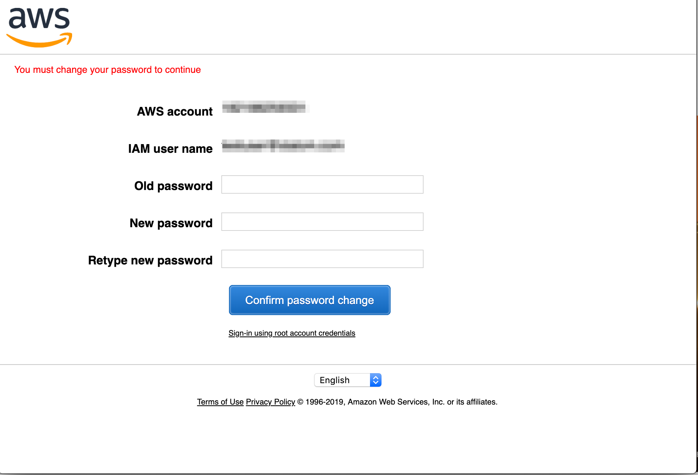
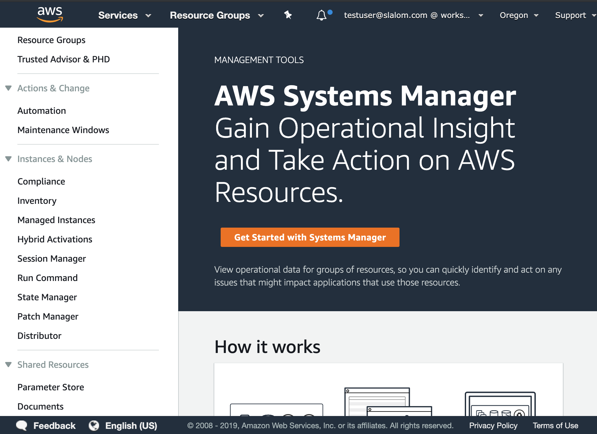
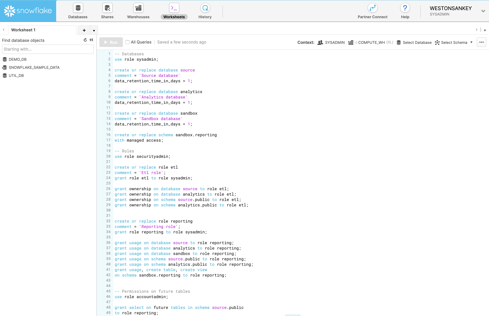
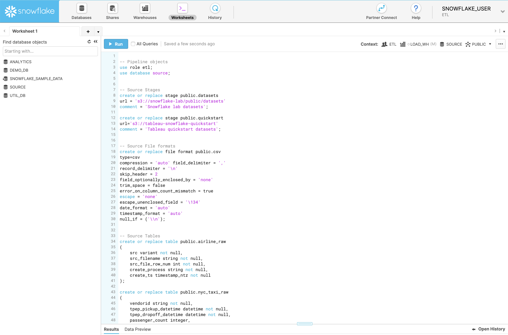
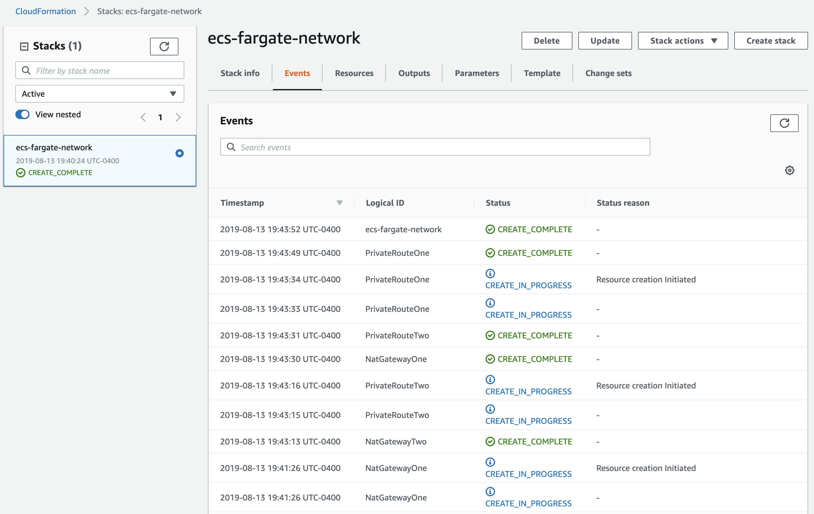
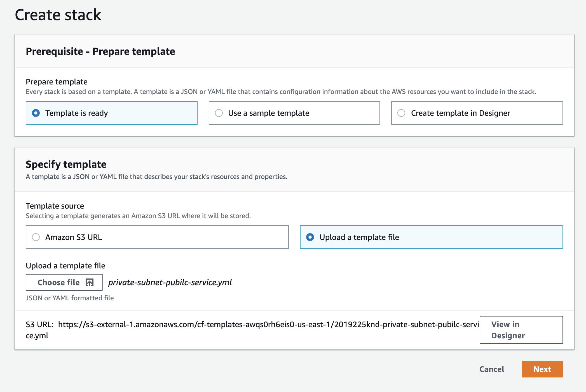
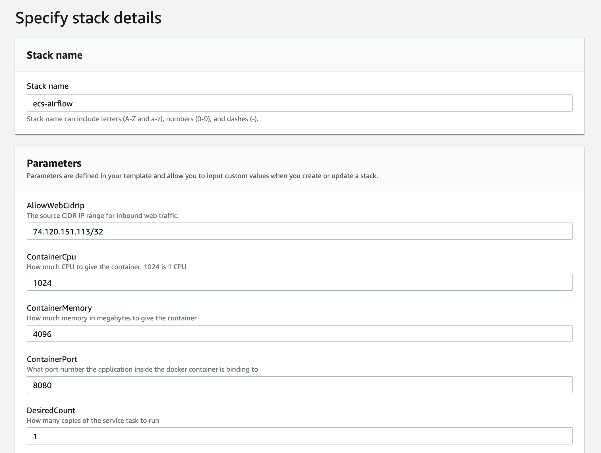
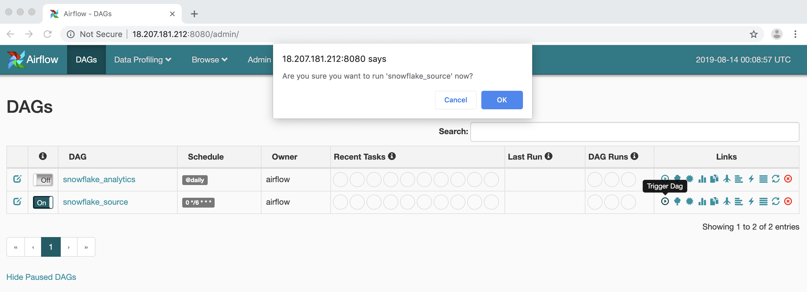
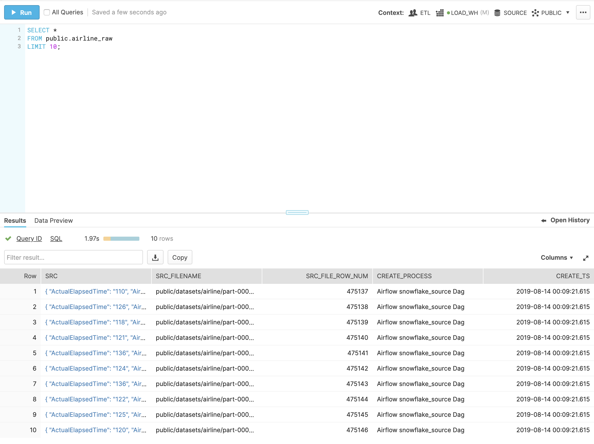

# slalom-aws-devday-2019

AWS Dev Day (AWS, Slalom, Snowflake, and Tableau)

A high level description will go here. A high level description will go here. A high level description will go here. A high level description will go here. We'll mention some of the components in the architecture

## Overview

The AWS Dev Day application demonstrates how to automate a Snowflake analytics pipeline running on Amazon Web Services. It is based on the [snowflake-on-ecs](https://github.com/SlalomBuild/snowflake-on-ecs) open-sourced framework from Slalom Build. Tableau Desktop is used to enable quick visualizations with your data.  The Dev Day activities are divided into the following sections:

- Getting Started
- Setting up Snowflake
- Building the Pipeline in AWS
- Running the Pipeline
- Visual Analytics with Tableau Desktop

## Getting Started

### Download the Code

Download the Dev Day code [here](https://snowflake-lab.s3-us-west-2.amazonaws.com/public/docs/slalom-aws-devday-2019-app.zip) and save to a location on your disk you can refer to later.

### Log into AWS

Log into the AWS account provided for the Dev Day. You can reach the sign-in console [here](https://workshops-innovationlab.signin.aws.amazon.com/console). Once logged in, you'll retrieve the password to be used with Snowflake in a later step.

1. Log into AWS using your username/password  

2. Change your password to something you can remember

3. Navigate to AWS Systems Manager and click 'Parameter Store'. SSM Parameter Store is used to store passwords in an encrypted format.

4. Retrieve the `snowflake_user` password you will use during the Snowflake steps. It will be stored under `/airflow-ecs/SnowflakeCntl`

## Setting Up Snowflake

### Log into Your Snowflake Account

Log into your Snowflake account with the username and password you created when you set it up.

### Setup the Snowflake Framework

Open the `setup_framework.sql` script in the Snowflake UI. We'll take a walk through the script and describe what it is doing and why. Then we'll instruct them how to run it in one shot. We'll explain why we are using this account to setup the framework, and that we'll be switching to another Snowflake account for the remainder of the Dev Day.

1. Copy the contents of the `setup_framework.sql` script (located in the `snowflake` directory) and paste in the Snowflake query editor window.

2. Highlight the query text and click on the blue Run button at the top left of the query editor window to run the script. This will create several objects in the database, including a few new databases, and a new user account that we'll use next.
3. Log out of your account by selecting the drop down menu on the top right of the window.

### Deploy the Source Database Objects

Log into Snowflake with the `snowflake_user` account and the password specified in the script. 
Open the `deploy_source.sql` script in the Snowflake UI. We'll take a walk through the script and describe what it is doing and why. Then we'll instruct them how to run it in one shot.

1. Log back in to Snowflake with the following credentials:
    - User Name: `snowflake_user`
    - Password: `__CHANGE__`
2. You will immediately be promted to change your password. Enter a secure password and click Finish. You are now logged in to the same Snowflake account as a different user.
3. Copy the contents of the `deploy_source.sql` script (located in the `snowflake` directory) and paste in the Snowflake query editor window.
4. Highlight the query text and click on the blue Run button at the top left of the query editor window to run the script. This will create two stage tables, a file format, and two tables that we'll be loading data from S3 into.

5. We're now done with the initial Snowflake framework setup. Next, we'll be provisioning infrastructure in AWS that will allow us to run Airflow jobs to load these Snowflake tables with data.

#

## Building the Pipeline in AWS

### Deploy Foundational Components - Instructor Only

Now that they have Snowflake installed, how can they leverage AWS to automatically load data? We'll build the Docker image, and run through the `snowflake-on-ecs` steps up until the ECS Network template is deployed.

### Deploy Airflow Running on ECS Fargate

The framework uses [Apache Airflow](https://airflow.apache.org/) for the workflow engine. ECS Fargate allows us to use any application built using a Docker image.

1. Log into AWS and navigate to Cloud Formation.

2. On the main Cloud Formation page, you'll see that a stack called `ecs-fargate-network` has already been created. This stack contains the core networking infrastucture, including the VPC, subnets, security groups, and ECS cluster, that we'll use as a foundation for our next deployment.

3. Click the Create Stack button at the top right of the page. In the "Specify template" section, select "Upload a template file". Click "Choose file" and navigate to the location where the project repository is cloned. Select the `cloudformation/private-subnet-pubilc-service.yml` file. Click Next.

4. On the next page, you'll see a list of parameters that we need to set. These will be injected into the Cloud Formation stack creation and will enable you to connect to Airflow from your computer once the ECS task is up and running. Set the following parameters then click Next:
    - Stack name: `ecs-airflow`
    - AllowWebCidrIp: `<your IP address>`
    - Snowflake account: this can be derived from the URL of your Snowlake account. For example: if the URL for your account is `https://ms72259.us-east-1.snowflakecomputing.com/`, then the account ID is `ms72259.us-east-1`
    - SnowflakeRegion - the region of your Snowflake account (corresponds to an AWS region)
  
  
5. On the next page, leave all of the default options and click Next. Scroll to the bottom of the next page and click Create Stack.
6. You'll be routed to a page that contains details on your stack. Click on the Events tab to see the progress of the stack creation. This process will take between 10 and 20 minutes. Once it's complete, you'll see an event indicating that the creation is complete.

7. Now that the stack has been created, navigate to ECS and select the single cluster that is running. 

8. On the cluster details page, select the Tasks tab and find the task with a task definition name that corresponds to the name you gave your Cloud Formation stack.

9. Select the task to view the task details. In the Network section, copy the Public IP address and paste it in your browser address bar. Append `:8080` to the IP address and navigate to the page. You should see the Airflow user interface.

## Running the Analytics Pipeline

### Code Walk Through - SQL and DAGs

RDS/ECS will take about 10 minutes to launch. Use this time to walk through the Snowflake SQL and the Airflow DAGs used to automate it. 

### Run the Pipeline

Launch Airflow on ECS Task public IP port 8080. Run the Source pipeline to load Source tables. Run Analytics pipeline to load Analytics tables. This will take some time to load. Go back to Snowflake and see the History tab, you can see Snowflake running the jobs and loading data. When it's done, Airflow UI will report success. We know it will since we've run this a billion times. Run a quick SQL query to see the data in the tables `query_analytics.sql`. Hey that's cool but we can do so much more, with Tableau!

1. In the Airflow UI, you should see two DAGs, `snowflake_analytics` and `snowflake_source`. Toggle the `snowflake_source` switch to On and select the Trigger Dag button in the Links section of the DAG row. When prompted to run the DAG, click OK.

2. The `snowflake_source` DAG is now running and loading data into Snowflake. Navigate back to Snowflake and click on the History button. You should see the progress of the queries that are being executed by Airflow.

3. After a few minutes, the DAG should be complete. Back in Snowflake, run a quick query on the `public.airline_raw` table to confirm that data was loaded successfully.
 

4. In Airflow, toggle the `snowflake_analytics` switch to On and select the Trigger Dag button in the Links section of the DAG row. When prompted to run the DAG, click OK. This DAG will take data loaded into the stage tables and load it into the final destination tables that can be used for analytical queries.

5. Once the DAG execution is complete, navigate back to Snowflake. Copy the contents of the `query_analytics.sql` script (located in the `snowflake` directory) and paste it in the Snowflake query window. Run the query.

## Run Tableau Desktop

Please click [here](https://snowflake-lab.s3-us-west-2.amazonaws.com/public/docs/AWS-Slalom-Snowflake-Tableau-DevDay-TableauDesktop-08.20.2019.pdf) to download the Tableau Desktop instructions, then please follow the instructions outlined in the document.
